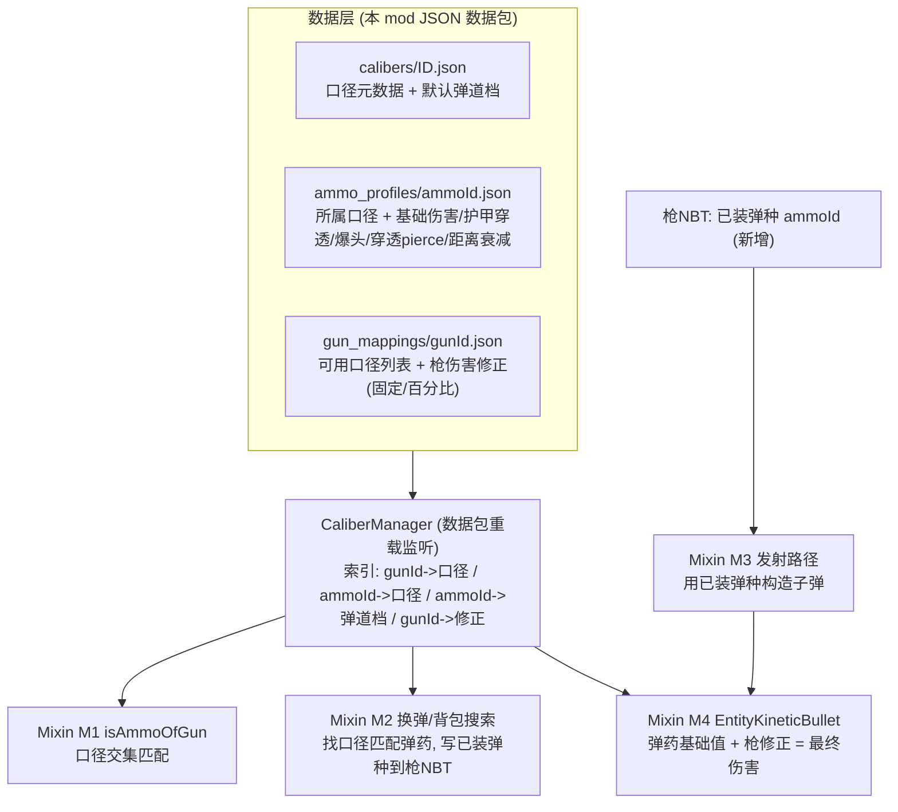

# TacZ 口径弹药系统重做 — 设计文档 (Stage 1)

> 目标: 把 TacZ 的 "枪 -> 单一弹药" 改为 "枪 -> 一个或多个口径, 口径 -> 多种弹种(HP/SP/FMJ/BP...)", 并把弹道/伤害数据从 "枪" 迁到 "弹药", 枪只保留伤害修正。
>
> In scope: 口径匹配层; 弹道所有权反转(弹药持有基础伤害/护甲穿透/爆头/穿透/距离衰减, 枪持有初速/重力及固定/百分比伤害修正); 新建一整套 TacZ 格式弹药并全量迁移原版枪械; JSON 数据包驱动; 未配置内容按规则自动派生。
>
> **Non-goals**: 不改后坐力/散布/射速/换弹时序等系统本身; 不做新的弹药渲染/模型体系(复用 TacZ 显示); 不支持非 TacZ 的枪; 不新增联机协议(沿用 TacZ 的 NBT 同步); 不改 TacZ 源码(仅 Mixin + 本 mod 数据包)。
>
> Constraints: Forge 1.20.1 / TacZ `1028108-8141310`(已经 CurseMaven 引入并解析); Mixin 已在 build.gradle.kts 注册; 保持与 TacZ 现有 gun pack 数据兼容。

## 1. 背景 / 问题

现状(已核实, javap 反编译自 `timeless-and-classics-zero-1028108-8141310.jar`):

- `GunData.ammoId: ResourceLocation` —— 一把枪只认一种弹药 id。
- `GunData.bulletData (BulletData)` —— 伤害 `damageAmount`、初速 `speed`、穿透 `pierce`、击退、点燃、曳光, 以及 `ExtraDamage` 的护甲无视 `armorIgnore`、爆头 `headShotMultiplier`、距离衰减 `damageAdjust` **全部定义在枪上**。
- 弹药物品 `AmmoIndexPOJO` 只有 `name/display/stackSize/tooltip/sort` —— 弹药是纯 "身份 + 显示", 不带任何弹道。
- 兼容判定 `IAmmo.isAmmoOfGun(gun, ammo)` 默认实现(字节码确认) =
  `getCommonGunIndex(gunId).map(idx -> idx.getGunData().getAmmoId().equals(ammoId)).orElse(false)` —— **精确 id 相等**。

痛点: 无法表达 "一个口径对应多种弹种, 一把枪吃一个/多个口径"; 也无法让 HP/SP/FMJ/BP 各有不同的伤害/穿透/爆头表现(因为弹道全绑在枪上)。

## 2. 方案 / 核心原理

两个改动叠加:

1. **口径层**: 在枪与弹药之间插入 "口径(caliber)"。枪声明可用口径集合; 弹药声明所属口径; 兼容 = 交集非空。
2. **弹道所有权反转**: 基础战斗数值(基础伤害、护甲穿透、爆头倍率、穿透、距离衰减)迁到 **弹药**; 枪只保留 **固定伤害** 与 **百分比伤害** 两类修正(初速/重力仍归枪, 移除枪上的护甲穿透/爆头/穿透)。**最终伤害 = (弹药基础) * (1 + 枪械百分比) + 枪械固定值**。

落地靠 4 个已核实的注入点(Mixin) + 一个数据包驱动的 `CaliberManager`。

**自动派生规则(关键, 兼顾 "全量迁移" 与 "未配置兼容")**: 默认把每把枪原始 `GunData.ammoId` 视为其唯一口径, 每个弹药物品原始 `ammoId` 视为其口径。于是 **未配置任何口径 JSON 时, 行为与原版完全等价**(单元素集合的交集 == 相等)。显式口径 JSON 再用于: 合并多个原始 ammoId 到一个口径 / 增加 HP/SP/FMJ/BP 变种 / 给枪多口径 / 覆盖弹道。

## 3. 架构与关键决策



关键决策:

- **为何 Mixin 而非纯数据/KubeJS**: 匹配与伤害计算是 TacZ 编译期逻辑, 无数据扩展点; `isAmmoOfGun` / `EntityKineticBullet` 必须字节码注入(用户已确认接受)。
- **为何在子弹构造处做伤害反转**: `EntityKineticBullet` 构造器已带 `ammoId + GunData + BulletData`(签名已核实), 在构造末尾按 `ammoId` 查弹药档覆盖 `damageAmount/armorIgnore/headShot` 字段, 下游 `getDamage/onHitEntity/createDamageSources` 无需再改。
- **为何新增 "已装弹种" NBT**: `IGun` 无 "当前已装填弹药 id" 的 getter(已核实), 多弹种时必须记录装的是哪个, 供发射与显示。
- **数据键用 TacZ 的 gunId/ammoId(ResourceLocation)**: 无法给 TacZ 的 POJO 加字段, 故用旁路映射按 id 关联。

伤害组合公式(已定):

- **最终伤害 = (弹药基础伤害) * (1 + 枪.percentDamage) + 枪.flatDamage**。基础伤害取弹药档距离-伤害曲线 `damageAdjust`(或标量 `baseDamage`)在当前距离的取值。
- 护甲穿透 `armorIgnore`、爆头 `headShotMultiplier`、穿透 `pierce`: **仅来自弹药**。
- **初速 `speed` / 重力 `gravity` 留在枪**; 射速/后坐/散布/换弹时序同样留在枪。
- 配件修饰(TacZ `modifyProperty`)在上式之后叠加(先后顺序实现期核实)。

## 4. 依赖

- **Hard**: TacZ `1028108-8141310`(`modImplementation` 经 CurseMaven, 已解析); Architectury Loom 内建 Mixin(已在 build.gradle.kts 注册 `tacz_ammo_reload.mixins.json`); Forge 1.20.1。
- **Soft / optional**: 无强制。TacZ 的配件修饰系统(`IGun.modifyProperty` / `resource.modifier.custom.*`)与本设计并行 —— 需保证配件对伤害的修正仍能与新公式叠加(风险项)。

## 5. 接口 / 契约(草案 —— 将在平行任务表冻结)

数据 schema(键 = TacZ ResourceLocation):

- caliber: `{ "name": string, "tooltip": string, "defaultProfile"?: AmmoProfile }`
- ammo_profile(按弹药物品 id): `{ "caliber": rl, "baseDamage": float | "damageAdjust": [[dist,dmg], ...], "armorIgnore": float, "headShotMultiplier": float, "pierce": int }`  (初速/重力不在弹药, 归枪)
- gun_mapping(按枪 id): `{ "calibers": [rl, ...], "flatDamage": float, "percentDamage": float }`
- 自动派生: 缺省开启; 未命中显式配置时 口径 = 原 `ammoId`, 弹道档 = 由枪原始 `bulletData` 派生。

Java 契约(命名待冻结):

- `CaliberManager`(SimpleJsonResourceReloadListener): `getGunCalibers(rl) -> Set<rl>`, `getAmmoCaliber(rl) -> rl`, `getAmmoProfile(rl) -> AmmoProfile`, `getGunModifier(rl) -> GunDamageModifier`; 未命中走自动派生。
- 已装弹匣 NBT 访问器(**逐发序列**, 支持彩虹弹): `getLoadedSequence(stack) -> List<(ammoId,count)>`(RLE 游程编码) / `setLoadedSequence(...)` / `popNextRound(stack) -> ammoId`(发射时出队)。NBT 键如 `TacAmmoReload:LoadedSeq`。单一弹种 = 长度为 1 的退化序列; 与 `IGun.currentAmmoCount` 保持 sum == count。
- Mixin 目标(已核实): `com.tacz.guns.api.item.nbt.AmmoItemDataAccessor#isAmmoOfGun`; `com.tacz.guns.api.item.nbt.AmmoBoxItemDataAccessor#isAmmoBoxOfGun`(弹药盒/包同样改口径匹配); `com.tacz.guns.entity.EntityKineticBullet`(构造器 / `getDamage` / `onHitEntity`)。目标待核实: 真实换弹消耗与序列写入(换弹状态机在 shooter, `LivingEntityAmmoCheck` 仅 needCheckAmmo/consumesAmmoOrNot 辅助); 发射出队处(类/方法)。

## 6. 风险与边界

| 风险 | 级别 | 缓解 |
|---|---|---|
| Mixin 随 TacZ 更新失效 | H | 锁版本; 集中 mixin; 每处 null 检查, 未命中回退原版逻辑 |
| 多弹种时换弹 "装哪一种" | L | 已定: 暂用背包扫描顺序取第一个口径匹配弹药(后续再加优先级/GUI) |
| 已装弹种 NBT 客户端/服务端同步 | M | 沿用 TacZ 的 NBT 同步; getCommonGunIndex 为服务端权威 |
| 与 TacZ 配件 modifyProperty 伤害修正叠加冲突 | M | 明确组合顺序: 弹药基础 -> 枪固定/百分比 -> 配件修饰 |
| 全量自动派生的正确性 | M | 派生 = 原 ammoId; 未配置即等价原版, 再逐口径显式覆盖 |
| 建整套 TacZ 格式弹药(各口径 HP/SP/FMJ/BP)的内容量 | M | 独立内容任务; 用模板 + 数据生成批量产出 |
| 逐发弹匣序列 NBT 的客户端/服务端同步与体积 | M | RLE 游程编码; 随 currentAmmoCount 一起同步; 上限校验 |
| 弹药包容器 GUI(NBT 序列化存储 + 5 格幽灵配置槽)复杂度 | M | 见第 10 节; 存储区无 slot(光标点击存入) + 数据渲染; 幽灵槽只存过滤器 |
| 压弹图案循环填装可能死循环(库存耗尽) | L | 一整轮无进展即跳出; 见第 10 节算法 |

**Boundaries —— 本项目不做**: 不改后坐/散布/射速/换弹时序算法; 不做弹药新渲染体系; 不动非 TacZ 的枪; 不改 TacZ 源码(仅 Mixin + 数据包)。

## 7. 核实状态

| 事项 | 状态 | 来源 / 确认方式 |
|---|---|---|
| GunData 有单一 ammoId + bulletData | verified | javap GunData |
| 弹道/护甲穿透/爆头全在枪(BulletData / ExtraDamage) | verified | javap BulletData, ExtraDamage |
| 弹药物品无弹道(AmmoIndexPOJO 仅显示) | verified | javap AmmoIndexPOJO |
| isAmmoOfGun = ammoId 精确相等 | verified | javap -c AmmoItemDataAccessor |
| EntityKineticBullet 构造带 ammoId+GunData+BulletData; onHitEntity/getDamage 为伤害点 | verified | javap EntityKineticBullet |
| IGun 无 "已装弹种 id" getter | verified | javap IGun |
| IAmmoBox 存储 = 单一 ammoId + count 序列化到 NBT(AMMO_ID_TAG/AMMO_COUNT_TAG) | verified | javap IAmmoBox, AmmoBoxItemDataAccessor |
| isAmmoBoxOfGun 也按 gunId->ammoId 匹配(需同改口径) | verified | javap AmmoBoxItemDataAccessor |
| LivingEntityAmmoCheck 仅 needCheckAmmo/consumesAmmoOrNot; 真实换弹搜索/消耗在别处 | verified | javap LivingEntityAmmoCheck |
| 真实换弹消耗与序列写入的精确类/方法 | to-verify | 反编译 shooter 状态机 / ModernKineticGunItem 换弹 |
| 发射处 bullet.ammoId 来源(改传已装弹种) | to-verify | 定位 shoot 构造子弹的类/方法 |
| 客户端弹药计数/显示(ClientAmmoIndex)受影响面 | to-verify | 读 client.resource.index |

## 8. 已决策(原开放问题, 2026-07-14 确认)

- 初速 `speed` / 重力 `gravity` **归枪**; 穿透 `pierce` **归弹药**。
- 换弹选弹种: **暂用背包顺序**(扫描背包取第一个口径匹配的弹药; 暂不做优先级/记忆/GUI)。
- 弹药内容: **新建一整套 TacZ 格式弹药**(作为本 mod 内置 TacZ gun pack), 覆盖各口径的 HP/SP/FMJ/BP 等型号; 我方 caliber / ammo_profile 侧车数据按其 ammoId 关联。
- 伤害公式: **最终伤害 = (弹药基础) * (1 + 枪械百分比) + 枪械固定值**; 配件 `modifyProperty` 修饰在此之后叠加(先后顺序实现期核实)。

剩余 to-verify(见第 7 节): 换弹搜索精确方法 / 发射处 ammoId 来源 / 客户端显示影响面。

## 9. 关键骨架(最风险处, 伪代码)

```java
// M1: 口径交集匹配 (Mixin AmmoItemDataAccessor#isAmmoOfGun, @Inject cancellable 或 @Overwrite)
Set<ResourceLocation> gunCals = CaliberManager.getGunCalibers(gunId);
ResourceLocation ammoCal = CaliberManager.getAmmoCaliber(ammoId);
return ammoCal != null && gunCals.contains(ammoCal);

// M4: 弹药基础值 + 枪修正 (Mixin EntityKineticBullet 构造末尾)
AmmoProfile p = CaliberManager.getAmmoProfile(this.ammoId);   // 缺省: 由枪 bulletData 派生
if (p != null) {
    this.damageAmount = p.damageCurve();                       // 基础伤害曲线来自弹药
    this.armorIgnore  = p.armorIgnore();                       // 护甲穿透仅弹药
    this.headShot     = p.headShotMultiplier();                // 爆头仅弹药
    this.pierce       = p.pierce();                            // 穿透仅弹药 (初速/重力仍来自枪)
}
// 最终伤害 (在 getDamage(distance) 内组合):
//   float base = baseFromCurve(this.damageAmount, distance);          // 弹药基础
//   GunDamageModifier m = CaliberManager.getGunModifier(this.gunId);  // 枪: 百分比 + 固定
//   return base * (1 + m.percentDamage()) + m.flatDamage();
```

## 10. 弹药包 (Ammo Pouch) 补充设计

### 10.1 目标与定位

新物品 `弹药包`: (1) 大容量 **序列化存储** 弹药; (2) 配置 **压弹顺序**(混装 / 彩虹弹)。参考 TacZ 现有 `AmmoBox`(单一 ammoId + count 序列化到 NBT, 已核实), 但本包为 **多弹种存储 + 5 格压弹图案**。

示例: 图案 [1 号=5 HP, 2 号=5 AP], 一把 30 发上限的步枪重装后按 `5HP,5AP,5HP,5AP,5HP,5AP` 填装(图案循环直到弹匣满)。图案为空 -> 退回第 8 节默认顺序。

### 10.2 数据模型 (NBT)

- 存储区: `Map<ammoId, int>` 序列化到 NBT(把 TacZ AmmoBox 的 AMMO_ID_TAG/AMMO_COUNT_TAG 扩成列表); **容量上限在 `AmmoPouchItem` 物品类中定义**(Java 常量, 不走 config/数据; 不分 level)。
- 压弹图案: `List<PatternEntry>`(<=5), `PatternEntry = { ammoId, perCycle }`。空图案 -> 默认顺序。
- NBT 键: `TacAmmoReload:PouchStore`, `TacAmmoReload:PouchPattern`。

### 10.3 GUI / 容器布局(从上到下)

- **顶部 存储区**: 数据驱动展示已存弹种与数量; **无 slot**——光标持有弹药时点击存储区即存入(序列化进 NBT 计数并消耗光标上的弹药); 点击某已存弹种取回到光标。
- **中部 5 个横向幽灵配置槽**: 每格设 {弹种过滤(放入一发弹药确定类型) + 每轮发数}; 例 1 号=5 HP, 2 号=5 AP。幽灵槽不消耗真实物品。
- **底部 玩家背包**。
- 菜单: `AmmoPouchMenu extends AbstractContainerMenu` + 服务端同步 NBT; 幽灵槽用自定义 Slot(不接收真实物品, 只记录 filter + count)。

### 10.4 压弹图案算法(换弹时构建逐发序列)

```java
// 换弹: 依据弹药包图案构建逐发序列 (RLE)
List<Round> buildSequence(Gun gun, Pouch pouch) {
    int cap = gun.magazineCapacity();                     // GunData.ammoAmount / 扩容
    Set<RL> cals = CaliberManager.getGunCalibers(gun.id());
    List<PatternEntry> pat = pouch.pattern().stream()     // 只留口径 属于 枪口径集 的项
        .filter(e -> cals.contains(CaliberManager.getAmmoCaliber(e.ammoId))).toList();
    if (pat.isEmpty()) return defaultFill(gun, pouch, cap); // 第 8 节默认: 库存/背包顺序
    List<Round> seq = new ArrayList<>();
    while (seq.size() < cap) {
        int before = seq.size();
        for (PatternEntry e : pat) {
            int take = min(e.perCycle, cap - seq.size(), pouch.store(e.ammoId));
            for (int i = 0; i < take; i++) seq.add(new Round(e.ammoId));
            pouch.consume(e.ammoId, take);
            if (seq.size() == cap) break;
        }
        if (seq.size() == before) break;                  // 一整轮无进展 -> 库存耗尽, 停止
    }
    return seq;                                            // RLE 后写入 gun LoadedSeq NBT
}
```

### 10.5 与基础设计的耦合(重要修正)

- **枪 NBT 从 "单一已装弹种" 升级为 "逐发弹匣序列"**(第 5 节已更新): 彩虹弹要求每发记录各自弹种。发射(M3)出队下一发 -> 决定 bullet.ammoId -> 弹道(M4)。
- 换弹来源选择: **弹药包必须放在快捷栏**才生效; 取快捷栏(槽 0-8)中第一个可用(能供该枪口径弹)的弹药包, 用其图案构建序列; 无可用包则回退第 8 节默认(背包顺序单一弹种)。
- `isAmmoBoxOfGun` 同步改为口径匹配(第 7 节已核实)。

### 10.6 接口契约(草案, 待冻结)

- `AmmoPouchItem`(存储 + 图案 NBT 访问器): `getStore(stack) -> Map<rl,int>` / `deposit / withdraw` / `getPattern(stack) -> List<PatternEntry>` / `setPattern(...)`。
- `AmmoPouchMenu` / `AmmoPouchScreen`(客户端)。
- 换弹钩子(Mixin/事件): 在真实换弹消耗处优先咨询弹药包, 产出 `LoadedSeq`。

### 10.7 已决策与待定

已决策(2026-07-14):
- **弹药包必须放在快捷栏**(槽 0-8)才生效; 换弹取快捷栏首个可用包, 不搜整背包。
- **容量上限在 `AmmoPouchItem` 物品类中定义**(Java), 不走 config/数据; 不分 level。
- **存储区无 slot**: 光标持弹点击存储区即存入(序列化进 NBT); 点击已存弹种取回光标。
- **每轮发数(perCycle)** = 图案每格每轮循环填装的发数(例中的 5); 填装算法已用 `min(perCycle, 弹匣剩余, 库存)` 截断, 无需独立硬上限, UI 输入范围取 `1 .. 弹匣容量`。

待定:
- 存储区"取出"的精确手感(单发 / 整组 / Shift 全取)。
- perCycle 的 UI 输入控件(数字框 / 滚轮 / 加减按钮)。

## Revision Log

- 2026-07-14 — 初稿(Stage 1)。基于 javap 核实 TacZ 8141310 的弹药/伤害模型; 5 项高杠杆决策(弹道所有权反转 / 接受 Mixin / 全量迁移 / JSON 数据包 / 自动派生兼容)已与用户确认。
- 2026-07-14 — 补充 4 项细节决策: 初速/重力归枪、穿透归弹药; 换弹暂用背包顺序; 新建整套 TacZ 格式弹药; 最终伤害 = 弹药基础 * (1 + 枪百分比) + 枪固定值。第 8 节开放问题全部结清。
- 2026-07-14 — 新增第 10 节 弹药包(Ammo Pouch): 多弹种序列化存储 + 5 格压弹图案(彩虹弹)。驱动基础设计修正: 枪已装弹 NBT 由单一弹种升级为逐发序列(RLE); 新增 `isAmmoBoxOfGun` 口径匹配注入点; 核实 IAmmoBox / LivingEntityAmmoCheck。
- 2026-07-14 — 弹药包细节定稿: 必须置于快捷栏才生效; 容量上限在 AmmoPouchItem 物品类中定义(不分 level); 存储区无 slot(光标持弹点击存入); 明确 perCycle 语义(每格每轮填装发数, 无独立硬上限)。第 10.7 节开放问题结清。
