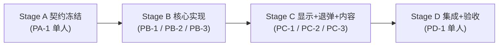

# TacZ 口径弹药系统 — 平行任务表 (Stage 3 · 多 Agent 并行, 约 3 Agent)

> 来源: [设计文档](tacz-caliber-ammo-design.md) + [总任务表](tacz-caliber-ammo-tasks.md)。
> **规则: 同阶段任务不共享文件、互不依赖(并行); 跨阶段可依赖(串行, 每阶段末有 Gate)。**
> **范围: 全项目除弹药包(总表 Stage 6 / M6 / T6.x)外的全部内容。** 弹药包留待其后单独并行。

## 0. Agent 使用方式

1. 认领一个"前置阶段全部 ☑"的任务: 状态 ☐→◐, 在 owner 栏签名。
2. 只改自己 **Owns** 的文件; **Reads** 只读。
3. 完成后按 §1 更新三处文档。

图例: ☐ 待办 · ◐ 进行中 · ☑ 完成 · ⛔ 阻塞。

## 1. 进度回写协议

1. **一文件一 owner**(见 §6), 绝不改他人 Owns 文件。
2. **认领**: ☐→◐ + 签名。
3. 完成时**行级精确**更新(先读后写, oldString 不匹配就重读重试, 绝不整段覆盖):
   - (a) 本表: 任务 ◐→☑ + 产出;
   - (b) 总任务表: 勾选映射的 `T*`;
   - (c) 设计文档: 仅当 to-verify 结清或设计变更。
4. **Gate**: 某阶段任务全 ☑ 后跑该阶段集成检查 → 解锁下一阶段。
5. **变更请求(CR)**: 要动冻结约定(§2)或他人文件, 在 §7 加一行并暂停、先协调。

## 2. 共享约定 (FROZEN — 无 CR 不得改)

**基础包** `com.tacz_caliber_ammo`; 子包 `.caliber` `.mixin` `.nbt` `.reload` `.client` `.network` `.registry`。
**MODID** `tacz_caliber_ammo`; **默认口径** `tacz_caliber_ammo:none`。
**NBT 键**: 枪已装弹匣 `tacz_caliber_ammo:LoadedSeq`(逐发 RLE)。
**自注册约定**: 每个子系统各自一个 `XxxBootstrap`(`@Mod.EventBusSubscriber(modid=MODID, bus=MOD)` 或游戏总线), 自行把 DeferredRegister/事件/reload 监听/网络包注册进去 —— **不设共享注册文件**, 主类 `TaczCaliberAmmo` 保持最小、不被并行任务改。
**mixins.json**: 由 Stage A 一次性登记**全部** mixin 类(见下), 之后冻结、任何 lane 不改; 各 lane 只填自己那个 mixin 类的方法体。
**Mixin remap(CR-1, 2026-07-15 补冻结)**: 凡目标为 **TacZ 类/成员** 的 mixin 必须用 `@Mixin(value = 目标.class, remap = false)`(类级置 remap=false, 会传给其 @Shadow/@Inject/@Redirect/@At)。否则 Mixin AP 报 "Unable to locate obfuscation mapping"(TacZ 成员不在 MC 映射表)。handler 方法体内的 MC 调用不受影响(由 Loom 正常重映射)。仅当目标是 MC 类时用默认 remap(如未来真去 mixin 原生类)。

**冻结数据类型(record, 由 A 建骨架)**:
```
record Caliber(ResourceLocation id, String name)   // tooltip 去字段: 改 tooltipKey()=caliber.<ns>.<path>.tooltip 由 id 生成 (CR-3)
record AmmoProfile(ResourceLocation caliber, float baseDamage, float armorIgnore, float headShotMultiplier, int pierce)
record GunDamageModifier(Set<ResourceLocation> calibers, float flatDamage, float percentDamage)
record Round(ResourceLocation ammoId, int count)   // LoadedSeq 的 RLE 段
```

**冻结接口签名**:
```
// caliber/CaliberManager.java  (静态门面; PB-1 实现, 其余只读)
Set<ResourceLocation> getGunCalibers(ResourceLocation gunId)       // 缺省由 ammoId 派生
ResourceLocation      getAmmoCaliber(ResourceLocation ammoId)      // 无 -> none
AmmoProfile           getAmmoProfile(ResourceLocation ammoId)      // 无 -> 由枪 bulletData 派生
GunDamageModifier     getGunModifier(ResourceLocation gunId)       // 无 -> flat0/percent0
void ingestAmmoJson(ResourceLocation id, JsonObject json)          // 供加载 mixin 灌入
void ingestGunJson(ResourceLocation id, JsonObject json)
void clear()

// nbt/LoadedAmmoSequence.java  (PB-2 实现, 其余只读)
List<Round>      getSequence(ItemStack gun)
void             setSequence(ItemStack gun, List<Round> seq)
ResourceLocation peekHead(ItemStack gun)                           // 上膛/下一发弹种
ResourceLocation popNextRound(ItemStack gun)                       // 出队一发, 计数-1
void reconcile(ItemStack gun, int currentAmmoCount, ResourceLocation defaultAmmoId)  // 边界: sum!=count 时重建

// reload/UnloadHandler.java (PC-2)   ;  network/CMsgUnloadAmmo(int gunSlot) (PC-2)
void unload(ServerPlayer player, ItemStack gun)
```

**冻结 JSON schema**:
- 弹药 JSON(TacZ gun pack, TacZ 忽略未知字段): `caliber`(string 口径 id, 缺省 none) + `baseDamage`(float) + `armorIgnore`(float 0-1) + `headShotMultiplier`(float) + `pierce`(int)。
- 枪 JSON(TacZ gun index): `calibers`(string[] 可选) + `flatDamage`(float) + `percentDamage`(float)。
- `data/tacz_caliber_ammo/calibers/<id>.json`: `{ "name": string }`(tooltip 移除, 由 id 生成本地化键 `caliber.<ns>.<path>.tooltip`; CR-3)。
- **口径 id 命名规范**: 小写、去 `mm`、`.`与空格→`_`、开头 `.`→`d`、`/`与`-`→`_`、剥离中文/括号限定词、合并连续 `_`(例 `7_62x51_nato` / `d308`)。

**冻结 mixin 类清单(A 建空骨架 + 登记 mixins.json)**:
| mixin 类 | 目标(TacZ) | 归属 lane |
|---|---|---|
| `CommonDataManagerMixin` | `CommonDataManager`(apply 末尾按 DataType 分发 AMMO_INDEX/GUN_INDEX) | PB-1 |
| `AbstractGunItemMixin` | `AbstractGunItem`(findAndExtractInventoryAmmo) | PB-2 |
| `ModernKineticGunScriptAPIMixin` | `ModernKineticGunScriptAPI`(shootOnce/reduceAmmoOnce) | PB-2 |
| `AmmoItemDataAccessorMixin` | `AmmoItem`(覆盖默认 isAmmoOfGun, CR-2) | PB-3 |
| `AmmoBoxItemDataAccessorMixin` | `AmmoBoxItem`(覆盖默认 isAmmoBoxOfGun, CR-2) | PB-3 |
| `EntityKineticBulletMixin` | `EntityKineticBullet`(构造末尾伤害反转) | PB-3 |

**冻结 i18n 键(前缀 `tacz_caliber_ammo`)**: `tooltip.…caliber` / `tooltip.…damage` / `tooltip.…no_caliber` / `gui.…unload`。(逐口径/逐弹种名由内容 gun pack 自带本地化。)

## 3. 阶段与依赖总览



| 阶段 | 并行任务 | 前置 | 里程碑 |
|---|---|---|---|
| A | PA-1(单人) | — | M0 契约冻结 |
| B | PB-1, PB-2, PB-3 | A | M1/M2/M3/M4 |
| C | PC-1, PC-2, PC-3 | B | M5 / M5b |
| D | PD-1(单人) | C | DoD 验收 |

## 4. 任务明细

### Stage A · 契约冻结  (前置: 无, 单人)

**PA-1 · 冻结全部契约与骨架**  ☑ owner:Agent 1 产出: 20 骨架文件 + mixins.json(7) + lang; build 绿; runServer 到 Done(13.5s), 7 个 mixin 全部生效
- Owns: `caliber/{Caliber,AmmoProfile,GunDamageModifier,Round}.java`(record 骨架)、`caliber/CaliberManager.java`(方法签名+空实现)、`nbt/{NbtKeys,LoadedAmmoSequence}.java`(签名)、`reload/{ReloadSequenceBuilder,UnloadHandler}.java`(签名)、`network/{ModNetwork,CMsgUnloadAmmo}.java`(通道+签名)、`client/TooltipHandler.java`(签名)、全部 `mixin/*Mixin.java`(空 `@Mixin` 骨架)、`src/main/resources/tacz_caliber_ammo.mixins.json`(登记全部)、`assets/tacz_caliber_ammo/lang/en_us.json`(静态 UI 键)、§2 本节补全。
- Reads: 设计 §5/§7、本表 §2。
- 交付/验收: `:1.20.1-forge:build` 成功(空骨架编译通过, mixin 空注入不报错); §2 所有名称/签名/键/schema 落定。
- Maps to: T0.1
> **Gate A**: `:1.20.1-forge:build` 绿; runClient 能进主菜单不崩(空 mixin 生效)。

### Stage B · 核心实现  (前置: A)
> 三 lane 文件互斥; 全部只读 §2 冻结面; 运行期集成在 Gate B 验证。

**PB-1 · 数据层 + 字段加载**  ☑ owner:Agent 1 产出: `CaliberManager`(getAmmoCaliber/getAmmoProfile/getGunCalibers/getGunModifier/getCaliber + 由 GunData.ammoId 派生口径 + rebuildAmmo/rebuildGun/rebuildCalibers) + `CommonDataManagerMixin`(apply@TAIL 按 DataType 灌 ammo/gun 字段) + `CaliberDataBootstrap`(AddReloadListener 载 calibers/*.json)。build 绿; runServer 日志 "loaded … of 24 ammo / of 54 gun" 命中真实 TacZ 数据、类型分发正确、Done 无错。字段解析正样例(含 caliber)因并发 Agent 占用共享 run/ 世界锁未能重跑复核(环境非代码), 解析代码路径已在 24+54 条真实数据上执行返回 null 正确。
- Owns: `caliber/CaliberManager.java`※、`caliber/*.java`(record 填充)※、`caliber/CaliberDataBootstrap.java`、`mixin/CommonDataManagerMixin.java`※(替代原两个序列化器 mixin, 见 CR-2)。
- Reads: §2 schema/签名; 设计 §5。
- 交付/验收: 给弹药/枪 JSON 加字段 → `/reload` 后日志打印各索引条数; `getAmmoCaliber/getAmmoProfile/getGunCalibers/getGunModifier` 对样例返回正确; 无字段 → none / 由 ammoId 或 bulletData 派生。
- Maps to: T1.1, T1.2, T1.3, T1.4, T1.5

**PB-2 · 弹匣序列 + 换弹写入 + 发射出队**  ☑ owner:Agent(PB-2) 产出: LoadedAmmoSequence(RLE+reconcile) + ModernKineticGunScriptAPIMixin(换弹背包差分写序列@consumeAmmoFromPlayer/putAmmoInMagazine + 发射@Redirect lambda$shootOnce$2 getAmmoId 出队); AbstractGunItemMixin 未用(差分法已覆盖); build 绿 + runServer Done + AP 校验注入点通过; 行为(装/射)验证留 Gate B。
- Owns: `nbt/LoadedAmmoSequence.java`※、`reload/ReloadSequenceBuilder.java`※、`reload/ReloadBootstrap.java`、`mixin/AbstractGunItemMixin.java`※、`mixin/ModernKineticGunScriptAPIMixin.java`※。
- Reads: `CaliberManager`(§2 只读)、`NbtKeys`; 设计 §5(FeedType/边界)。
- 交付/验收: 单测 RLE 往返 + 不一致 `reconcile` 回退默认; 普通换弹后 `LoadedSeq`=单弹种长度==装填数; 混装(命令构造)按序逐发消耗, `shootOnce` 每发用 `popNextRound` 的弹种; FUEL/INVENTORY 退化单弹种、无限用序列头。
- Maps to: T3.1, T3.2, T3.3

**PB-3 · 口径匹配 + 伤害反转**  ☑ owner:Agent 2 产出: 3 mixin —— AmmoItem/AmmoBoxItem 加 isAmmoOfGun/isAmmoBoxOfGun 做口径交集覆盖(AmmoBox 保留创造盒->true/空盒->false 前置判定), 数据未就绪回退 TacZ 原逻辑; EntityKineticBullet 构造 TAIL 按 ammoId 覆盖 damageAmount(单点=base*(1+percent)+flat, 无距离曲线)/armorIgnore(0-1)/headShot/pierce。全部 remap=false(CR-1); accessor 改注入具体类(CR-2)。build 绿; 字节码核验构造子(protected 10 参为唯一设字段处, 公有构造全 this() 委派到它, TAIL 注入每发生效)+ 6 个 @Shadow 字段签名逐一匹配 + isAmmoOfGun 参数序(gun,ammo)核对; runServer mixin PREPARE 无误(未到 Done: 并发服务器占世界锁, 非 PB-3 问题); 伤害/匹配游戏内实测留 Gate B。
- Owns: `mixin/AmmoItemDataAccessorMixin.java`※、`mixin/AmmoBoxItemDataAccessorMixin.java`※、`mixin/EntityKineticBulletMixin.java`※。
- Reads: `CaliberManager`(§2 只读); 设计 §7(伤害注入)。
- 交付/验收: 同口径不同型号弹药可换弹、异口径拒绝、未配置同原版; 子弹构造末尾按 `this.ammoId` 覆盖 `damageAmount`(单点=`ammoBase*(1+percent)+flat`, 无距离曲线)/`armorIgnore`(0-1)/`headShot`/`pierce`; 实测 HP vs FMJ 伤害不同且符合公式, 距离不影响。
- Maps to: T2.1, T2.2, T2.3, T4.1, T4.2, T4.3, T4.4
> **Gate B**: runClient — 给某枪 + 同口径 HP/FMJ 两种弹药, 换弹(混装可用命令)→ 逐发按序发射、伤害按弹种不同、异口径被拒、删数据包回退原版; 全程无崩溃。
> **[Gate B 状态 2026-07-15]** 集成构建绿 + runServer Done(无崩溃/无 mixin 错) + 三条数据加载链 0→2/2/1 + 核心判定自检 22/0(同口径接受/异口径拒绝/弹道档/枪修正/RLE 逐发按序)。**已过集成与逻辑层。** 游戏内开火/换弹 UI/伤害数值观测待手动 runClient(无头无玩家)。证据见 [gate-b-verification.md](gate-b-verification.md)。

### Stage C · 信息显示 + 退弹 + 内容  (前置: B)
> 三 lane 文件互斥(代码 vs 代码 vs 纯数据)。

**PC-1 · 信息显示(tooltip)**  ☑ owner:Agent 2 产出: TooltipHandler(订阅 ItemTooltipEvent: 悬停枪->可用口径集(过滤 none), 悬停弹药/弹药盒->口径 + baseDamage/armorIgnore(百分比)/headShot/pierce, caliber=none 含 TacZ 原版->"未配置口径"斜体标记; 只读 CaliberManager) + ClientDisplayBootstrap(@Mod.EventBusSubscriber FORGE+Dist.CLIENT 自注册, 主类不改)。用全部冻结 i18n 键(lang 未改, 无 CR); build 绿; 修正 ItemTooltipEvent 包名为 `net.minecraftforge.event.entity.player`。游戏内悬停可视化留手动 runClient(Gate C)。
- Owns: `client/TooltipHandler.java`※、`client/ClientDisplayBootstrap.java`、`assets/tacz_caliber_ammo/lang/en_us.json`※。
- Reads: `CaliberManager`(§2 只读)。
- 交付/验收: 订阅 `ItemTooltipEvent`; 悬停弹药显示 口径 + baseDamage/armorIgnore/headShot/pierce; 悬停枪显示口径; caliber=none 的弹药(含 TacZ 原版)显示"未配置口径"标记。
- Maps to: TT.1, TT.2, TT.3, (T3.4 可选客户端计数)

**PC-2 · 退弹**  ☑ owner:PC-2 产出: UnloadHandler(IGun 读弹匣, reconcile 后按 LoadedSeq 逐段分堆 giveItemToPlayer 归还各弹种; 创造/dummy 只清空; setCurrentAmmoCount(0)+setBulletInBarrel(false)+清 LoadedSeq) + CMsgUnloadAmmo(encode/decode/handle, 服务端按 selected 槽取枪并校验 IGun) + ModNetwork.register + UnloadBootstrap(FMLCommonSetup 注册包) + UnloadButtonAddon(Dist.CLIENT, ScreenEvent.Init.Post 给 GunRefitScreen 加退弹按钮, 主手枪 selected 槽, 空弹匣 active=false)。build 绿 + runServer Done(3.479s) 无崩溃、网络注册成功; 点按钮退弹的游戏内行为留 Gate C(runClient)。
- Owns: `reload/UnloadHandler.java`※、`network/{ModNetwork,CMsgUnloadAmmo}.java`※、`client/UnloadButtonAddon.java`、`reload/UnloadBootstrap.java`。
- Reads: `LoadedAmmoSequence`(§2 只读)、`AbstractGunItem.dropAllAmmo`(参考)。
- 交付/验收: `ScreenEvent.Init.Post` 给 `GunRefitScreen` 加"退弹"按钮(与 TacZ 原卸配件按钮区分)→ 发 `CMsgUnloadAmmo` → 服务端读 `LoadedSeq` 逐类型归还 + 清空弹匣; 空弹匣禁用。
- Maps to: TU.1, TU.2, TU.3

**PC-3 · 内容(口径 + 整套弹药 + 枪字段 + 配方)**  ◐ owner:Agent 2 产出(进行中): 打通并 runServer 核验内容加载链 —— `datagen`(ModDataGen+CaliberAmmoDataProvider) → `runData` → `src/generated/resources` 数据包 → TacZ `CommonDataManager` 扫 `data/tacz_caliber_ammo/index/ammo/<口径>/<型号>` → 本 mod `CommonDataManagerMixin` 读 caliber+伤害 → `CaliberManager`（**内置内容走数据包, 无需 gun pack 注册**）。已完成 **5.56x45 全 11 型号**(warmage/hp/mk_255_mod_0/mk_318_mod_0/m856/fmj/m855/m856a1/m855a1/m995/ssa_ap; 复用 `tacz:556x45_display`; 数值启发式基线)+ 口径定义(字面展示名); runServer 实测 `loaded 15 ammo profile(s) with caliber (of 37 ammo)` + `4 caliber definition(s)` + Done 无崩溃。**待续**: 其余 36 口径(按 calibers.md 扩 CALIBERS/AMMO 表 + runData)、枪 calibers/flat/percent 覆盖、配方/tags、弹药名 lang、数值平衡。
- Owns: `data/tacz_caliber_ammo/calibers/**`、内置弹药 gun pack(assets+data)`**`、TacZ 枪 JSON 字段覆盖 `data/tacz/**`(加 calibers/flat/percent)、`data/tacz_caliber_ammo/recipes/**`、`tags/**`。
- Reads: §2 schema + 命名规范; `Ammo.csv`; 枪→口径手动对照(用户提供, 见 PD-1)。
- 交付/验收: 依 `Ammo.csv` 建各口径 `calibers/*.json` 与逐弹种 JSON(caliber+伤害字段); 生存可获得; 经 PB-1 加载器读到; 数值一轮平衡。可**按口径细分为多个子任务并行**(每口径文件互不相干)。
- Maps to: T5.1, T5.2, T5.3, T5.4, T5.5, T5.6
> **Gate C**: runClient — tooltip 正确显示口径/伤害与"未配置口径"标记; 改装页退弹按钮可退回正确混装弹药; 新弹药可获得且伤害符合数据。

### Stage D · 集成 + 验收  (前置: C, 单人)

**PD-1 · 端到端验收 + 枪→口径对照落地**  ☐ owner:___ 产出:___
- Owns: `docs/` 验收记录、枪→口径对照数据(用户手动编译产物, 并入 PC-3 数据目录时以本任务为准)、平衡微调。
- Reads: 全部。
- 交付/验收: 走完下方 DoD; `:1.20.1-forge:build` + runServer/runClient 冒烟; 关键路径每项一条游戏内/日志证据。
- Maps to: (M5/M5b 验收)
> **Gate D**: DoD 全绿。

## 5. 研究结论(已填, 供下游只读)

- 换弹消耗 = `AbstractGunItem.findAndExtractInventoryAmmo`(按槽序提取, 知 ammoId); 上游 `ModernKineticGunScriptAPI.consumeAmmoFromPlayer`→`putAmmoInMagazine`。(CFR)
- 发射 = `ModernKineticGunScriptAPI.shootOnce`; `ammoId=gunData.getAmmoId()` 后 `new EntityKineticBullet(...)`, 每发 `reduceAmmoOnce()`。(CFR)
- 伤害 = `EntityKineticBullet` 构造末尾设 armorIgnore(0-1)/headShot/damageAmount(曲线); `onHitEntity` L416 `damage*=headShot`。(CFR)
- 弹药/枪 JSON = `CommonAmmoIndexSerializer`/`CommonGunIndexSerializer` → POJO(Gson 忽略未知字段); 弹药在 gun pack。(CFR)
- tooltip = `AmmoItem.m_7373_`(List<Component>); 退弹用 `ScreenEvent` 加按钮(TacZ 原 `RefitUnloadButton` 是卸配件)。(CFR)
- **(PA-1 实测) 7 个 mixin 已在 runServer 成功应用到 TacZ 类, 服务器 Done。空骨架若目标为接口须声明 `interface`(class 报 target type mismatch)。但 PB-3 需覆盖默认方法 isAmmoOfGun/isAmmoBoxOfGun, 接口 mixin 不支持 @Inject/覆盖默认方法 → CR-2 改注入具体类 `AmmoItem`/`AmmoBoxItem`(加同名方法即覆盖继承的接口默认实现, 虚分派命中)。**

## 6. 文件归属矩阵(防冲突)

> ※ = 跨阶段接力(A 建骨架 → B/C 填充), 串行安全; 同阶段绝不共享。

| 文件 / 目录 | 归属 | 阶段 |
|---|---|---|
| `caliber/{Caliber,AmmoProfile,GunDamageModifier,Round}.java` | PA-1→PB-1 ※ | A→B |
| `caliber/CaliberManager.java` | PA-1→PB-1 ※ | A→B |
| `caliber/CaliberDataBootstrap.java` | PB-1 | B |
| `mixin/CommonDataManagerMixin.java` | PA-1→PB-1 ※ | A→B |
| `nbt/NbtKeys.java` | PA-1 | A |
| `nbt/LoadedAmmoSequence.java` | PA-1→PB-2 ※ | A→B |
| `reload/ReloadSequenceBuilder.java`, `reload/ReloadBootstrap.java` | PA-1→PB-2 ※ / PB-2 | A→B / B |
| `mixin/AbstractGunItemMixin.java`, `mixin/ModernKineticGunScriptAPIMixin.java` | PA-1→PB-2 ※ | A→B |
| `mixin/AmmoItemDataAccessorMixin.java`, `mixin/AmmoBoxItemDataAccessorMixin.java`, `mixin/EntityKineticBulletMixin.java` | PA-1→PB-3 ※ | A→B |
| `client/TooltipHandler.java`, `assets/…/lang/en_us.json` | PA-1→PC-1 ※ | A→C |
| `client/ClientDisplayBootstrap.java` | PC-1 | C |
| `reload/UnloadHandler.java`, `network/{ModNetwork,CMsgUnloadAmmo}.java` | PA-1→PC-2 ※ | A→C |
| `client/UnloadButtonAddon.java`, `reload/UnloadBootstrap.java` | PC-2 | C |
| `data/tacz_caliber_ammo/**`, 内置 gun pack, `data/tacz/**` 枪覆盖, `recipes/**`, `tags/**` | PC-3 | C |
| `tacz_caliber_ammo.mixins.json` | PA-1(冻结) | A |
| `TaczCaliberAmmo.java`(主类) | PA-1(最小, 不再改) | A |

## 7. 变更日志 (CR)

| # | 日期 | 提出 | 变更(约定/借用文件) | 处置 |
|---|---|---|---|---|
| CR-1 | 2026-07-15 | PB-2(Agent) | 补冻结约定: 所有目标 TacZ 的 mixin 用 `@Mixin(remap=false)` | 已写入 §2; PB-2/PB-3 已遵(PB-3 3 个 mixin 全补 remap=false, AP 警告清零, build 绿); PB-1 待确认 |
| CR-2 | 2026-07-15 | PB-3(Agent 2) | §2 mixin 清单: 两个 accessor mixin 目标由接口 `AmmoItemDataAccessor`/`AmmoBoxItemDataAccessor` 改为具体类 `AmmoItem`/`AmmoBoxItem`(接口 mixin 不支持 @Inject/覆盖默认方法; 具体类加同名方法即覆盖继承的默认实现)。仅动 PB-3 自有文件, 不影响他 lane, mixins.json 类名不变。 | 已改; §2 表/§5 已更新 |
| CR-2 | 2026-07-15 | PB-1(Agent 1) | 数据字段加载 mixin 由 `AmmoIndexSerializerMixin`+`GunIndexSerializerMixin`(目标两序列化器) 改为单个 `CommonDataManagerMixin`(目标 `CommonDataManager.apply`); 内部 `ingestAmmoJson/ingestGunJson/clear` → `rebuildAmmo/rebuildGun`(读 API 不变) | 因序列化器 `deserialize` 只有原始 JSON、拿不到 index 的 `ResourceLocation` id, 而 `apply(Map<id,JsonElement>,…)` 同时有 id+原始 JSON+`type` 字段; 已更新 §2 mixin 清单/§6 矩阵; 读 API(§2 冻结面)未变、下游无影响; PB-1 已遵 CR-1(`@Mixin(remap=false)`) |
| CR-3 | 2026-07-15 | PB-1(Agent 1) | `Caliber` record 去 `tooltip` 字段 → `record Caliber(id, name)` + 方法 `tooltipKey()`(由 id 生成 `caliber.<ns>.<path>.tooltip`); `calibers/*.json` 去 `tooltip` 键 | 用户指示: 口径说明改由 id 自动生成本地化、不再用 JSON 字符串; 已更新 §2 冻结 record/schema + design §2/§12; 唯一消费者 PC-1 `TooltipHandler` 仍骨架, 后续改用 `tooltipKey()`+`I18n.exists` 渲染; build 绿 |
| CR-4 | 2026-07-15 | 用户+Agent 2 | 枪口径解析改 **4 级优先链**（modify_gun_caliber > index/gun > 原生子弹转口径 > 模糊匹配 > none）。改 PB-1 `CaliberManager`(重构 `getGunCalibers`; `getAmmoCaliber` 加内置 `NATIVE_MAP`(19 条原生弹→口径)回退; 加 `MODIFY`+`rebuildModify`+`fuzzyCaliber`)。新增 `config/{ModConfig,ConfigBootstrap}`(Forge 配置 `enableFuzzyCaliberMatch` 默认 true)、`caliber/GunCaliberModifyBootstrap`(modify_gun_caliber 加载器)、`datagen/GunCaliberModifyProvider`(7.62x39×4 枪 demo)。 | 用户设计+批准(计划 session/plan.md); runServer 核验: Tier1 优先(ak47/rpk/sks_tactical/type_81→7_62x39)、Tier3 native(glock_17→9x19 / kar98→7_92x57_mauser / deagle→d50_ae)、config 注册(toml 生成)、modify 加载 4 枪、Done 无崩溃; build 绿。改了 PB-1 owns 的 CaliberManager —— 读 API 签名不变, 仅解析增强, 下游(PB-3/PC-1)无需改。游戏内行为留 Gate C。 |
| CR-5 | 2026-07-15 | 用户+Agent | 枪械 tooltip 两处客户端改造(新 `mixin/client/ClientGunTooltipMixin`, `@Mixin(ClientGunTooltip, remap=false)`): (Task 1) 从 tooltip 去掉 `damage/armorIgnore/headShotMultiplier` 三行且**回收纵向空隙**(伤害归弹药, 枪不显示): `@Inject(renderText, HEAD, cancellable, remap=true)` 照原布局重画但跳过这三行+压缩 yOffset+`ci.cancel()`, 配 `@Inject(getHeight, RETURN, cancellable, remap=true)` 减高(BASE_INFO -10 / EXTRA_DAMAGE_INFO -20)。**注**: 初版用 `getText` 置 `Component.empty()`, 但 TacZ tooltip 固定行高 → 只会留空行, 故用户追加要求后改为重画 renderText+缩 getHeight。(Task 2) `@Redirect renderImage`(MC 继承方法, 单独 `remap=true`)重定向 AMMO_INFO 图标渲染 `GuiGraphics.renderItem`, 按枪口径每秒轮询显示该口径下各弹药图标(id 排序), 空口径回退原图标。新增读 API `CaliberManager.getAmmosForCaliber(caliberId)->List`(AMMO+NATIVE_MAP, 去重排序); mixins.json `client:[client.ClientGunTooltipMixin]`。 | 用户 3 任务之 Task1/Task2; `:1.20.1-forge:compileJava` 绿(仅 ResourceLocation 弃用告警), 全部 API 调用解析通过(IGun.getGunId / AmmoItemBuilder / renderItem / renderText+getHeight 的 9 个 @Shadow + shouldShow / getAmmosForCaliber)。**mixin 运行期生效 + 三行消失/无空隙/高度收紧/图标轮询 的游戏内可视行为未核验, 留用户 runClient 重启验证**(客户端 AMMO 仅单机/dev 生效, 多人同步不在本次范围; NATIVE_MAP 静态兜底保证非空)。 |
| CR-6 | 2026-07-15 | 用户+Agent | **Task 2 重定义**: 弹药匹配显示由"按口径轮询"改为"渲染当前弹匣内全部弹药"。同一 `@Redirect renderImage`(remap=true) 改为读 `LoadedAmmoSequence.getSequence(gun)` 的 RLE 段, 按装填顺序逐段画 [弹药图标 + 该段数量(文字, `GuiGraphics.drawString` 画在图标右侧)], curX 递进 `17+font.width(count)+4`; 空弹匣回退原(枪默认弹)单图标。配套新增 `@Inject(getText, TAIL)` 按行宽撑 `maxWidth`(防溢出), 并把 renderText 里 AMMO_INFO 的弹药名/弹量文字改为不画(`yOffset+=24` 占位)。移除轮询相关(CYCLE_MS/pickCyclingAmmo/getGunCalibers 调用)与 ammoName/ammoCountText 两 @Shadow, 新增 `int maxWidth` @Shadow。`getAmmosForCaliber` 遂无调用方(保留)。 | 用户追加需求(替换为当前装填弹药, 按顺序+数量, 数量用文字); `:1.20.1-forge:compileJava` 绿(仅 ResourceLocation 弃用告警), API 全解析(AmmoItemBuilder/renderItem/drawString/Font.width/Minecraft.font/LoadedAmmoSequence/Round)。**运行期依赖 `LOADED_SEQ` NBT 被装填逻辑写入并同步到客户端才有分段内容; 否则回退单图标**。游戏内可视行为(分段图标+数量, 顺序, 撑宽)未核验, 留 runClient。 |
| CR-7 | 2026-07-15 | 用户+Agent | **Task 2 三改(现版)**: 弹匣显示由"图标+数量"改为**纯文本行**。每个 RLE 段一行 `"{count}x {abbr}"`(如 `5x M855`), 最多 5 行(`MAX_LINES`)。abbr = 本地化键 `ammo.<ns>.<path(/换.)>.abbr`(`I18n.exists`->`get().replace('_',' ').trim()`; 无则回退 path 末段大写), 同 `AmmoCodeDecorator` 取法; abbr 键已在 `lang/{en_us,zh_cn}.json`。实现: renderImage 由 `@Redirect` 改 `@Inject(HEAD,cancellable,remap=true)` 整体 `ci.cancel()`(不画图标); renderText 的 AMMO_INFO 块改画文本行 `font.drawInBatch(Component.literal(line),...)` 每行 yOffset+=10; getHeight 里 AMMO_INFO 定高 24 改 `行数*10`; getText,TAIL 按 `font.width(line)` 撑 maxWidth。移除 GROUP_GAP 加 `MAX_LINES=5`; 移 Redirect/AmmoItemBuilder import 加 I18n/Component/ResourceLocation/ArrayList/Locale。 | 用户追加需求(纯文本, .abbr+数量, 最多5行); `:1.20.1-forge:compileJava` 绿(仅 ResourceLocation 弃用告警), API 全解析(Component.literal/Font.drawInBatch/Font.width/I18n/ResourceLocation.getPath/LoadedAmmoSequence/Round)。**依赖同 CR-6(LOADED_SEQ 写入+同步); 空弹匣 -> AMMO 区高度 0(区消失)**。游戏内可视(文本行内容/顺序/最多5/撑宽)未核验, 留 runClient。 |
| CR-8 | 2026-07-15 | 用户+Agent | **创造模式换弹弹种追踪**: 改 `ModernKineticGunScriptAPIMixin.putAmmoInMagazine(@At RETURN)` 里 reconcile 的默认弹种 `def` 计算——本次换弹未真正消耗背包(`add`/pendingConsumed 为空, 即创造/不需消耗弹药)时, 先扫背包取第一颗“该枪匹配口径”的弹药弹种(新 `@Unique firstMatchingInventoryAmmo`: 遍历 `ForgeCapabilities.ITEM_HANDLER`, `IAmmo.isAmmoOfGun`/`IAmmoBox.isAmmoBoxOfGun` 命中即返回其 `getAmmoId`, 跳过空盒/`DefaultAssets.EMPTY_AMMO_ID`; **仅读、不 extract**), 有则用它作 `reconcile` 的默认弹种(按背包真实弹种装填/追踪、保持创造无限), 无匹配弹药才回退枪默认弹种 `gunData.getAmmoId()`(之前逻辑)。`add` 非空(生存真消耗)分支不变。 | 用户需求(创造下背包有匹配弹药就装填该弹种、不扣除, 无则默认); `:1.20.1-forge:compileJava` 绿(仅 ResourceLocation 弃用告警), API 解析(DefaultAssets.EMPTY_AMMO_ID / IAmmo.isAmmoOfGun+getAmmoId / IAmmoBox.isAmmoBoxOfGun+getAmmoId)。**游戏内(创造换弹装填背包弹种、空背包回退默认)未核验, 留 runClient**。 |
| CR-9 | 2026-07-15 | 用户+Agent | **Task 2 四改(现版) + 口径移位 + 弹量恢复**: 弹匣显示由纯文本行改为 **"口径行 + 两列表格"**。(1) 表格: A 列"容量"(列名 + 当前/上限弹量, 重新 `@Shadow ammoCountText`), B 列"装填"(列名 + 弹匣弹药明细 `"{count}x {abbr}"`, 最多 5 + 超补 "..."); 列名用 I18n 键 `tooltip.tacz_caliber_ammo.mag.capacity/loaded`(容量/装填, en=Capacity/Loaded, 加到两 lang.json)。(2) **子弹与容量文字改白色 0xFFFFFF**(原橙 0xFFAA00; 列名 0xAAAAAA)。(3) **枪口径移到表格上方一行**: `TooltipHandler` 删 ItemTooltipEvent 的 appendGun 分支, 抽出 `public static gunCaliberLine(gunId)`, mixin 在 AMMO_INFO 顶部渲染。getHeight: AMMO_INFO 行数 = (口径?1:0)+1(列名)+max(1,子弹行); getText,TAIL 撑两列/口径宽。renderImage 仍整体 cancel。 | 用户追加(表格化 A1/B1 列名 A2 容量 B2-7 子弹; 口径移到弹匣上一行; 子弹白色); `:1.20.1-forge:compileJava` 绿(仅 ResourceLocation 弃用告警), API 全解析(Component.translatable/literal, Font.drawInBatch/width, TooltipHandler.gunCaliberLine, IGun.getGunId, 9 @Shadow)。**游戏内(表格布局/列对齐/白字/口径行/撑宽)未核验, 留 runClient**; 弹匣明细仍依赖 LOADED_SEQ 写入+同步。 |

## 8. 平行任务 ↔ 里程碑 ↔ 总任务表

| 平行任务 | 总表 IDs | 里程碑 |
|---|---|---|
| PA-1 | T0.1 | M0 |
| PB-1 | T1.1–T1.5 | M1 |
| PB-2 | T3.1–T3.3 | M3 |
| PB-3 | T2.1–T2.3, T4.1–T4.4 | M2, M4 |
| PC-1 | TT.1–TT.3, T3.4 | M5b |
| PC-2 | TU.1–TU.3 | M5b |
| PC-3 | T5.1–T5.6 | M5 |
| PD-1 | (M5/M5b 验收) | DoD |

## Revision Log

- 2026-07-15 — 初版(Stage 3)。由总任务表派生(除弹药包)。A 冻结契约(含全部 mixin 骨架 + mixins.json + 自注册约定, 消除共享文件); B(数据/序列·换弹·发射/匹配·伤害)3 lane; C(显示/退弹/内容)3 lane; D 串行验收。文件归属矩阵证明同阶段零共享。
