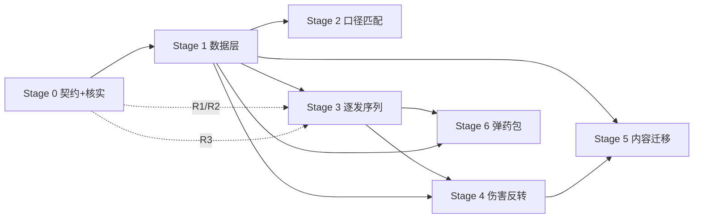

# TacZ 口径弹药系统 — 总任务表 (Stage 2 · Master Task Plan)

> 来源: [设计文档](tacz-caliber-ammo-design.md)。范围: 口径匹配 + 弹道所有权反转 + 逐发弹匣序列 + 全量弹药/枪械迁移 + 弹药包。
> 状态: `[ ]` todo · `[~]` in-progress · `[x]` done · `[!]` blocked。复杂度: S/M/L。**不给时间估计。**
> 约定: 「验证」一律指可在游戏内 / 日志 / 单测中核对的具体状态。弹药包(Stage 6)按用户要求置于最后。
> 未决问题集中在文末「待用户澄清 (Q)」; 依赖它们的任务已在 Deps 列标注 `Qn`。

## 里程碑

| 里程碑 | 交付物(可验证状态) | 对应 Stage |
|---|---|---|
| M0 | 关键注入点已反编译核实; 共享契约(包/类名/NBT 键/JSON schema)冻结, 骨架可编译 | Stage 0 |
| M1 | 数据包可加载; `CaliberManager` 能查 gun/ammo -> 口径 / 弹道档 / 修正; 自动派生生效 | Stage 1 |
| M2 | 枪按口径接受弹药(同口径不同型号可换弹, 异口径拒绝); 未配置内容等价原版 | Stage 2 |
| M3 | 枪 NBT 存逐发弹匣序列; 换弹写入序列, 发射按序出队消耗 | Stage 3 |
| M4 | 弹药持有基础伤害/护甲穿透/爆头/穿透; 枪只做固定+百分比修正; 最终伤害符合公式 | Stage 4 |
| M5 | 整套 TacZ 格式弹药(各口径型号) + 全部原版枪械映射到口径; 数值平衡 | Stage 5 |
| M5b | 退弹(GunRefitScreen 按钮按 LoadedSeq 归还) + 信息显示(弹药 tooltip 口径/伤害, 枪显示口径) | Stage 5b |
| M6 | 弹药包: 多弹种序列化存储 + 5 格压弹图案; 快捷栏换弹按图案组成彩虹弹序列 | Stage 6 |

## 冻结契约 (Stage 0 冻结, 后续只读)

- 基础包 `com.tacz_caliber_ammo`; 子包 `.caliber` `.data` `.mixin` `.nbt` `.reload` `.item` `.menu` `.client` `.network` `.registry`。
- MODID `tacz_caliber_ammo`; NBT 键前缀 `tacz_caliber_ammo:`。
- 数据类型(record): `Caliber`, `AmmoProfile`, `GunDamageModifier`, `PatternEntry`(见 §5)。
- 管理器: `CaliberManager`(SimpleJsonResourceReloadListener)。
- NBT 键: 枪 `tacz_caliber_ammo:LoadedSeq`(逐发 RLE 序列); 弹药包 `tacz_caliber_ammo:PouchStore` / `tacz_caliber_ammo:PouchPattern`。
- **弹药数据在弹药自身 JSON**(TacZ gun pack): 新增 `caliber`(缺省 `none`) + 伤害字段(baseDamage/armorIgnore/headShotMultiplier/pierce), 经 Mixin 弹药加载读取。枪口径默认由 `GunData.ammoId` 对应弹药的 caliber 派生。枪 JSON 同样新增 calibers/flatDamage/percentDamage(经 Mixin 枪加载读取)。`calibers/*.json`(本命名空间, 可选)仅存口径元数据。
- **模式**: **弃用 枪->单一弹药, 改为 枪->口径**(枪声明口径, 不再引用弹药 id)。
- **弹药 id 命名规范(已核实: ResourceScanner 递归 + FileToIdConverter 子路径进 id)**: 弹药按 `口径id/型号id` 子目录组织 -> `data/tacz_caliber_ammo/index/ammo/<口径id>/<型号id>.json` = id `tacz_caliber_ammo:<口径id>/<型号id>`(例 `.../5_56x45/m855.json` -> `tacz_caliber_ammo:5_56x45/m855`)。型号id 用口径同规则; 命名空间必须 `tacz_caliber_ammo`; 引用处用完整含斜杠 id。
- Mixin 类命名 `<目标>Mixin`, 置于 `.mixin`, 全部登记进 `tacz_caliber_ammo.mixins.json`。
- **伤害公式(冻结)**: `final = ammoBase(dist) * (1 + gun.percentDamage) + gun.flatDamage`; `armorIgnore` / `headShot` / `pierce` 仅来自弹药; `speed` / `gravity` 仅来自枪。

## Stage 0 · 反编译核实 + 契约冻结 -> M0

| ID | 任务(清晰描述) | Cx | Deps | 验收标准 | 文件 |
|---|---|---|---|---|---|
| `[x]` T0.1 | 冻结共享契约: 建包骨架与空 record/接口(`Caliber/AmmoProfile/GunDamageModifier/PatternEntry` 及 `CaliberManager` 签名占位), 定义 NBT 键常量类与数据包目录常量; 补全本表「冻结契约」节 | S | — | `:1.20.1-forge:compileJava` 成功; 契约节列出全部跨任务名称/键/路径, 下游任务只引用不改动 | `caliber/*.java`(占位), `nbt/NbtKeys.java`, 本文档 |
| `[ ]` T0.2 | 反编译核实**真实换弹消耗与序列写入点**: 定位 shooter 状态机 / `ModernKineticGunItem` 中对 `currentAmmoCount` 增量、决定"装几发/装哪把"的确切类与方法(SRG+名), 给出 Mixin `@Inject` 策略 | M | — | 产出 R1: 类名 + 方法签名(javap 确认) + 注入点说明 | 文档(R1) |
| `[ ]` T0.3 | 反编译核实**发射构造子弹处**: 定位创建 `EntityKineticBullet` 并传入 `ammoId` 的类与方法, 确认能改为从 `LoadedSeq` 出队取该发弹种 | M | — | 产出 R2: 类名 + 方法签名(javap) + 注入策略 | 文档(R2) |
| `[ ]` T0.4 | 核实**客户端弹药显示**受影响面: `ClientAmmoIndex` / HUD 弹药计数是否需按"当前/下一发弹种"改造 | S | — | 产出 R3: 需否客户端改造的结论 + 若需要则目标类/方法 | 文档(R3) |

## Stage 1 · 数据层 + CaliberManager -> M1

| ID | 任务 | Cx | Deps | 验收标准 | 文件 |
|---|---|---|---|---|---|
| `[x]` T1.1 | 数据类型与解析: 定义 `Caliber`(name,tooltip,defaultProfile?) / `AmmoProfile`(caliber, baseDamage 标量[默认], armorIgnore, headShot 倍率, pierce; damageAdjust 曲线可选) / `GunDamageModifier`(calibers[], flatDamage, percentDamage) / `PatternEntry`(ammoId, perCycle) 的 record + Gson/Codec 解析; 定数据包路径与键映射约定 | M | T0.1 | 单测/日志: 解析样例 JSON 得到正确字段; 非法 JSON 报清晰错误 | `caliber/*.java` |
| `[x]` T1.2 | `CaliberManager`(SimpleJsonResourceReloadListener): 加载三类目录, 建索引 `gunId -> Set<caliber>` / `ammoId -> caliber` / `ammoId -> AmmoProfile` / `gunId -> GunDamageModifier`; 提供 getter | M | T1.1 | `/reload` 后日志打印各索引条数; 查询 API 对样例数据返回正确 | `caliber/CaliberManager.java`, `registry/*` |
| `[x]` T1.3 | 自动派生规则: 未命中显式配置时 口径 = 原 `GunData.ammoId`(枪) / 原 `ammoId`(弹); `AmmoProfile` 由该枪 `bulletData` 派生; `GunDamageModifier` 缺省 flat=0/percent=0 | M | T1.2 | 未配置的枪/弹匹配与原版一致; 派生 `AmmoProfile` 数值 == 原 `bulletData`(日志比对) | `caliber/CaliberManager.java` |
| `[x]` T1.4 | 注册 reload 监听 + (按需)服务端->客户端索引同步 | S | T1.2 | 专用服务器与单机均可查询; 客户端需要时能读到口径(接 T0.4) | `registry`/事件, `network`(按需) 【实现: 弹药/枪走 `CommonDataManagerMixin` 搭 TacZ reload 便车、口径定义走 `CaliberDataBootstrap` 的 `AddReloadListenerEvent`, 均无独立监听注册; 单机/集成服已验证, **专用服务器->客户端同步暂缓(按需)**】
| `[x]` T1.5 | **Mixin 弹药/枪加载读新增字段**(实现改用单 `CommonDataManagerMixin` 注入 `CommonDataManager.apply` 末尾, 按 `DataType` 分发 AMMO_INDEX/GUN_INDEX → rebuildAmmo/rebuildGun, 直读原始 JSON; 因序列化器拿不到 index id, 见 parallel CR-2): 弹药 JSON 的 caliber+baseDamage/armorIgnore/headShotMultiplier/pierce, 枪 JSON 的 calibers/flatDamage/percentDamage; 存入 CaliberManager 索引; 缺省 caliber=none/派生 | M | T1.2 | 给弹药/枪 JSON 加字段 -> reload 后 CaliberManager 能读到; 无字段 -> none/派生 | `mixin/*`, `caliber/CaliberManager.java` |

## Stage 2 · 口径匹配 Mixin -> M2

| ID | 任务 | Cx | Deps | 验收标准 | 文件 |
|---|---|---|---|---|---|
| `[x]` T2.1 | Mixin `AmmoItemDataAccessor#isAmmoOfGun` -> 口径交集(枪口径集合与弹药口径有交集即通过); null / 未命中回退原逻辑 | M | T1.2, T1.3 | 游戏内: AK47 + 同口径不同型号弹药(不同 id)-> 可换弹; 异口径 -> 拒绝; 未配置枪弹 -> 同原版 | `mixin/AmmoItemDataAccessorMixin.java`, `tacz_caliber_ammo.mixins.json` |
| `[x]` T2.2 | Mixin `AmmoBoxItemDataAccessor#isAmmoBoxOfGun` -> 口径匹配 | S | T1.2 | 弹药盒按口径供弹给同口径枪 | `mixin/AmmoBoxItemDataAccessorMixin.java` |
| `[x]` T2.3 | 回退与容错: 数据未加载/口径缺失时不崩、按原版匹配 | S | T2.1, T2.2 | 移除全部数据包后仍按原版匹配、无异常日志 | (随 T2.1/T2.2) |

## Stage 3 · 逐发弹匣序列: NBT + 换弹写入 + 发射出队 -> M3

| ID | 任务 | Cx | Deps | 验收标准 | 文件 |
|---|---|---|---|---|---|
| `[x]` T3.1 | `LoadedAmmoSequence` NBT 访问器: RLE 编解码 `List<(ammoId,count)>` 读写枪 stack; `popNextRound(stack) -> ammoId`; **边界: sum(seq)!=currentAmmoCount 时用默认弹种(缺省=枪 GunData.ammoId)重建/补齐/截断; seq 空但 count>0 时 pop 返回默认** | M | T0.1 | 单测: RLE 往返; pop 计数递减; **不一致时回退默认、不崩** | `nbt/LoadedAmmoSequence.java` |
| `[x]` T3.2 | 换弹写入序列(依 R1): 在真实换弹消耗处生成并写入 `LoadedSeq`; 默认(无弹药包)= 背包顺序单一弹种的退化序列 | L | T0.2, T3.1 | 普通换弹后 `LoadedSeq` = 单一弹种、长度 == 装填数、与 currentAmmoCount 一致 | `mixin/reload*`, `reload/ReloadSequenceBuilder.java` |
| `[x]` T3.3 | 发射出队(依 R2): 每次射击 `popNextRound` -> 作为 `EntityKineticBullet` 的 `ammoId` | L | T0.3, T3.1 | 混装序列按顺序逐发消耗; 每发 `bullet.ammoId` 与序列头一致(日志) | `mixin/*ShootMixin.java` |
| `[ ]` T3.4 | 客户端显示(依 R3, 若需要): 展示当前/下一发弹种 | S/M | T0.4, T3.1 | HUD/tooltip 正确显示已装序列或下一发 | `client/*` |

## Stage 4 · 伤害所有权反转 -> M4

| ID | 任务 | Cx | Deps | 验收标准 | 文件 |
|---|---|---|---|---|---|
| `[x]` T4.1 | Mixin `EntityKineticBullet` 构造末尾: 按 `this.ammoId` 取 `AmmoProfile`, 覆盖 `damageAmount`(曲线)/`armorIgnore`/`headShot`/`pierce`; 无 profile 保留原(派生)值 | M | T1.2, T3.3 | 子弹字段 == 弹药档值(调试/日志) | `mixin/EntityKineticBulletMixin.java` |
| `[x]` T4.2 | 最终伤害公式: `ammoBaseDamage * (1 + gun.percent) + gun.flat`(标量, **无距离曲线**); armorIgnore/headShot 沿用 TacZ | M | T4.1 | 实测同枪 HP vs FMJ 伤害不同且符合公式; 距离不影响伤害; 改 percent/flat 线性影响 | `mixin/EntityKineticBulletMixin.java` |
| `[x]` T4.3 | 移除枪侧重复弹道: 护甲穿透/爆头只来自弹药(枪 `bulletData` 对应值被忽略); speed/gravity 仍取枪 | S | T4.1 | 改枪 `bulletData` 的 armorIgnore/headShot 不影响最终; 改弹药档则生效 | `mixin/EntityKineticBulletMixin.java` |
| `[x]` T4.4 | 配件 `modifyProperty` 叠加顺序: 核实并确定 弹药基础 -> 枪修正 -> 配件修饰 的顺序, 保证配件伤害修正仍生效、不重复计算 | M | T4.2 | 装伤害类配件后最终伤害按既定顺序变化 | `mixin/*`, 文档 |

## Stage 5 · 内容: 整套弹药 + 全量枪械迁移 -> M5

| ID | 任务 | Cx | Deps | 验收标准 | 文件 |
|---|---|---|---|---|---|
| `[ ]` T5.1 | 口径清单与命名(依 CSV): 规范化规则 = 小写、移除 mm、"."与空格转 `_`、开头 "." 转 `d`、`/` 与 `-` 转 `_`、剔离中文/括号限定词、合并连续 `_`(例 "7.62x51mm NATO"->`7_62x51_nato`, ".308"->`d308`)。定 `calibers/*.json` | M | T1.2, R4 | 每口径 id 合法且唯一; 样例映射符合规则; calibers JSON 经 T1.2 加载 | `data/.../calibers/*` |
| `[ ]` T5.2 | 整套 TacZ 格式弹药(内置 gun pack): 每口径按 CSV 型号集产出 index/display/model/贴图 | L | T5.1, R4 | 游戏内可获得各型号弹药物品, 名称/图标正确 | 资源 + `data`(gun pack) |
| `[ ]` T5.3 | `ammo_profiles/*`: 每型号 baseDamage(标量) / armorIgnore / headShot(倍率) / pierce | L | T5.1, M4 | 各型号伤害表现不同且符合设定; 经 T1.2 加载 | `data/.../ammo_profiles/*` |
| `[ ]` T5.4 | `gun_mappings/*`: 每把原版枪 -> 口径 + flat/percent 修正 | L | T5.1 | 每把枪能装其口径全部型号; 修正生效 | `data/.../gun_mappings/*` |
| `[ ]` T5.5 | 新弹药获取途径: 配方/创造标签/JEI。(原版弹药**不再禁用**; 改为未配置口径弹药加特殊 tooltip 标记, 见 TT.3) | M | T5.2 | 生存可制作/获得新弹药; 创造/JEI 分类正确 | `data/recipes`, `tags` |
| `[ ]` T5.6 | 数值平衡校对 | M | T5.3, T5.4 | 一轮对比测试, 无明显离谱值 | `data/*` |

## Stage 5b · 退弹 + 信息显示 -> M5b

| ID | 任务 | Cx | Deps | 验收标准 | 文件 |
|---|---|---|---|---|---|
| `[x]` TU.1 | 退弹服务端逻辑: 读枪 `LoadedSeq` 逐 (ammoId,count) 归还弹药(参 `AbstractGunItem.dropAllAmmo` 分堆/`giveItemToPlayer`, 但按序列各类型); 清空 LoadedSeq + `setCurrentAmmoCount(0)` + `setBulletInBarrel(false)` | M | T3.1, T3.2 | 装混装弹后退弹 -> 背包收回各正确类型与数量; 枪清空 | `reload/UnloadHandler.java` |
| `[x]` TU.2 | 网络包 `CMsgUnloadAmmo(gunSlot)` client->server + 注册 | S | TU.1 | 客户端触发 -> 服务端执行退弹 | `network/CMsgUnloadAmmo.java` |
| `[x]` TU.3 | 客户端在 `GunRefitScreen` 加"退弹"按钮(Forge `ScreenEvent.Init.Post` 或 Mixin), onPress 发包; 弹匣空则禁用 | M | TU.2 | 改装页出现退弹按钮; 点击退弹; 空弹匣禁用。注: 与 TacZ 原卸配件按钮区分 | `client/*`, `mixin/*`(可选) |
| `[x]` TT.1 | 弹药 tooltip: 订阅 Forge `ItemTooltipEvent`, 对 IAmmo 追加 口径 + baseDamage/armorIgnore/headShot/pierce(读 CaliberManager) | M | T1.5 | 悬停弹药显示口径与全部伤害数据; 无数据显示 none/缺省 | `client/TooltipHandler.java` |
| `[x]` TT.2 | 枪 tooltip: 对 IGun 追加 口径(可用口径集) | S | T1.5, TT.1 | 悬停枪显示其口径 | `client/TooltipHandler.java` |
| `[x]` TT.3 | 未配置口径(caliber=none)的弹药(含 TacZ 原版)加一行特殊 tooltip 标记 | S | TT.1 | 无口径弹药悬停显示"未配置口径"类标记 | `client/TooltipHandler.java`, lang |

## Stage 6 · 弹药包 Ammo Pouch -> M6  (置于最后)

| ID | 任务 | Cx | Deps | 验收标准 | 文件 |
|---|---|---|---|---|---|
| `[ ]` T6.1 | `AmmoPouchItem` + 存储 NBT: `Map<ammoId,int>` 序列化(键 `PouchStore`); 容量上限 = 物品类常量; `deposit/withdraw/getStore` API | M | T0.1, Q5 | 单测: 存/取更新 NBT 计数; 超上限被拒 | `item/AmmoPouchItem.java`, `nbt/*` |
| `[ ]` T6.2 | 压弹图案 NBT: `List<PatternEntry>`(<=5, 键 `PouchPattern`); `get/setPattern` | S | T6.1 | 单测: 图案读写正确、上限 5 | `item/AmmoPouchItem.java` |
| `[ ]` T6.3 | `AmmoPouchMenu`(服务端容器): 5 幽灵配置槽 + 存储区数据(无真实存储 slot)+ 玩家背包; 注册 MenuType | L | T6.1, T6.2 | 打开容器不崩; 幽灵槽与背包状态同步 | `menu/AmmoPouchMenu.java`, `registry/ModMenus.java` |
| `[ ]` T6.4 | `AmmoPouchScreen`(客户端): 顶部存储区(渲染已存弹种/数量)+ 中部 5 幽灵槽(弹种 + perCycle 输入)+ 底部背包 | L | T6.3, Q6 | 界面正确渲染各区; perCycle 可输入 | `client/AmmoPouchScreen.java` |
| `[ ]` T6.5 | 存储区特殊交互: 光标持弹点击存储区 -> 存入(序列化, 消耗光标); 点击已存弹种 -> 取回光标; 服务端权威 + 网络包 | M | T6.3, T6.4, Q6 | 光标持 HP 点击 -> 存入且计数 +; 点击弹种 -> 取回光标 | `menu/*`, `network/*` |
| `[ ]` T6.6 | 换弹集成: 换弹时扫快捷栏(槽 0-8)取首个可用弹药包 -> `buildSequence(图案)` -> 写 `LoadedSeq`(接 T3.2) | L | T3.2, T6.2 | 30 发步枪 + 图案[5HP,5AP] 换弹后 `LoadedSeq` = 5HP,5AP,...(共 30) | `reload/PouchReloadSource.java`, `mixin/reload*` |
| `[ ]` T6.7 | 口径过滤 + 空图案回退: 只用口径属于枪口径的图案项; 库存耗尽/无匹配 -> 回退默认或停止(防死循环) | S | T6.6 | 异口径图案项被跳过; 库存不足按可用量装填、不卡死 | `reload/PouchReloadSource.java` |
| `[ ]` T6.8 | 弹药包 物品注册/配方/贴图/JEI | M | T6.1 | 生存可获得弹药包; 有图标/名称 | `registry/*`, `data/recipes`, 资源 |

## 依赖图 + 关键路径

关键路径: `T0.1 -> T1.1 -> T1.2 -> (T0.2/T0.3) -> T3.1 -> T3.2 -> T3.3 -> T4.1 -> T4.2 -> T5.3/T5.4 -> T5.6`。弹药包 M6 主要卡在 `T3.2`(换弹写序列)完成后。

## 阻塞研究 / 待核实 (R)

| ID | 事项 | 阻塞 | 解决方式 |
|---|---|---|---|
| `[x]` R1 | **已核实**: 换弹消耗 = `AbstractGunItem.findAndExtractInventoryAmmo(handler, gun, n)`(按槽序提取, 知 ammoId); 上游 `ModernKineticGunScriptAPI.consumeAmmoFromPlayer` -> `putAmmoInMagazine` | T3.2 | CFR 反编译; LoadedSeq 在此处记录 |
| `[x]` R2 | **已核实**: 发射 = `ModernKineticGunScriptAPI.shootOnce`; `ammoId=gunData.getAmmoId()` 后 `new EntityKineticBullet(...ammoId...)`; 每发 `reduceAmmoOnce()` 扣弹 | T3.3 | CFR; Mixin shootOnce: reduceAmmoOnce 处 popNextRound + 换 ammoId |
| `[x]` R3 | **已核实(部分)**: `GunHudOverlay` 显示 currentAmmoCount(+按 gun ammoId 图标); 逐发弹种显示需 Mixin 该类(低优先, 外观) | T3.4 | CFR; 细节实现期定 |
| `[x]` R4 | **已提供**: `docs/Ammo.csv`(30+ 口径 x 型号集); 驱动 Stage 5 内容 | T5.1, T5.2 | Ammo.csv 已到位 |

## 待用户澄清 (Q) —— 记录不确定, 需用户决策

| ID | 问题 | 我的建议默认 | 影响任务 |
|---|---|---|---|
| Q1 | 弹药"基础伤害"用曲线还是标量? | **已定(07-15): 先用单一标量**(距离衰减留作后续可选, 可能再调) | T1.1, T5.3 |
| Q2 | "爆头伤害"= 倍率还是独立数值? | **已定(07-15): 倍率 `headShotMultiplier`** | T1.1, T4.1, T5.3 |
| Q3 | 原版 TacZ 弹药物品如何处理? | **已定(07-15 修订): 不禁用**, 改为给未配置口径弹药(含原版, caliber=none)加特殊 tooltip 标记(TT.3) | T5.5, TT.3 |
| Q4 | 每口径型号集合如何定? | **已定(07-15): 每口径各有型号集, 由用户稍后提供的 CSV 驱动**(= R4) | T5.1, T5.2, T5.3 |
| Q5 | 弹药包容量上限的具体数值(物品类常量)? | 暂定较大值(如每包 1200 发); 待定 | T6.1 |
| Q6 | 弹药包 GUI 细节: 存储区"取出"手感(单发/整组/Shift 全取)? perCycle 输入控件(数字框/滚轮/加减)? | 取出=点击取一组、Shift 全取; perCycle=加减按钮+数字 | T6.4, T6.5 |

## 风险登记 (源自设计 §6)

| 风险 | 级别 | 缓解 | 相关任务 |
|---|---|---|---|
| Mixin 随 TacZ 更新失效 | H | 锁版本; 集中 mixin; 每处 null 检查, 未命中回退原版 | T2.1, T3.2, T3.3, T4.1 |
| 逐发序列 NBT 客户端/服务端同步与体积 | M | RLE 编码; 随 currentAmmoCount 同步; 上限校验 | T3.1, T3.4 |
| 与 TacZ 配件 `modifyProperty` 伤害叠加冲突 | M | 明确 弹药 -> 枪 -> 配件 的顺序 | T4.4 |
| 全量自动派生正确性 | M | 派生=原 ammoId; 未配置即等价原版, 再逐口径显式覆盖 | T1.3, T5.1 |
| 建整套弹药内容量大 | M | 模板 + 数据生成批量产出 | T5.2, T5.3 |
| 弹药包容器 GUI(无 slot 存储 + 幽灵槽)复杂度 | M | 存储区光标点击存入 + 数据渲染; 幽灵槽只存过滤器 | T6.3, T6.4, T6.5 |
| 压弹图案循环填装死循环 | L | 一整轮无进展即跳出 | T6.7 |

## 完成定义 (DoD)

- `[ ]` M2: 一把原版枪能装其口径的多个不同型号弹药; 异口径被拒; 删数据包后回退原版, 全程无崩溃。
- `[ ]` M3: 通过命令/测试装入混装序列, 逐发按序消耗, `bullet.ammoId` 与序列一致。
- `[ ]` M4: 同枪不同弹种伤害不同且等于 `ammoBase*(1+percent)+flat`; 护甲穿透/爆头仅由弹药决定。
- `[ ]` M5: 全部原版枪械可用其口径全部型号; 无未归类的原版弹药; 一轮平衡校对完成。
- `[ ]` M6: 弹药包可存多弹种; 快捷栏内配置图案 [5HP,5AP], 30 发步枪换弹得 5HP,5AP,...(共 30); 空图案回退默认。
- `[ ]` 质量: `:1.20.1-forge:build` 通过; 关键路径任务各有一条游戏内/日志验证记录; 所有 Q 已由用户拍板并回写本表与设计文档。

## Revision Log

- 2026-07-15 — 初稿(Stage 2)。由设计文档派生 M0-M6 与 Stage 0-6 任务; 3 项反编译核实列为 R1-R3(=T0.2-T0.4); 6 项待用户澄清 Q1-Q6 已记录并附建议默认。
- 2026-07-15 — 结清 Q1-Q4: 基础伤害先用单一标量; 爆头用倍率; 禁用原版弹药物品; 每口径型号集由用户 CSV 驱动(新增 R4)。Q5/Q6 仍待定。
- 2026-07-15 — 项目改名 tacz_caliber_ammo；结清 R1-R4(CFR 反编译): findAndExtractInventoryAmmo(换弹)/shootOnce(发射)/CommonAmmoIndexSerializer(弹药加载)/Ammo.csv。数据模型改为: 弹药 caliber+伤害字段写进弹药 JSON(缺省 none), 枪口径由 ammoId 派生。
- 2026-07-15 — 新增: T1.5(Mixin 弹药/枪加载读字段)、T3.1 不一致回退默认、Stage 5b(退弹 TU.1-3 + 信息显示 TT.1-2)。弹药包仍为最后(Stage 6)。
- 2026-07-15 — 缺口决策回写: T4.2 标量无曲线; T5.1 口径命名规范; T5.5 原版不禁用改 TT.3 tooltip 标记(Q3 修订); 新增 TT.3。FeedType/无限/上嬜弹见设计 §5。
